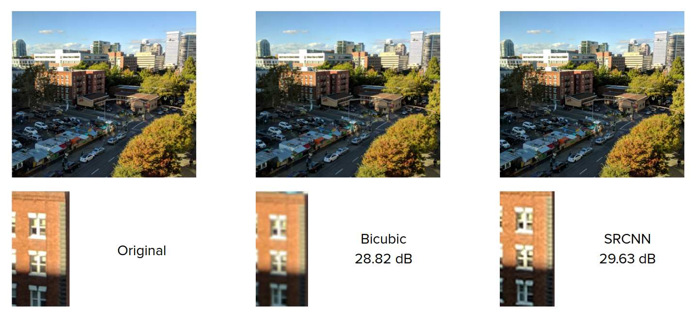
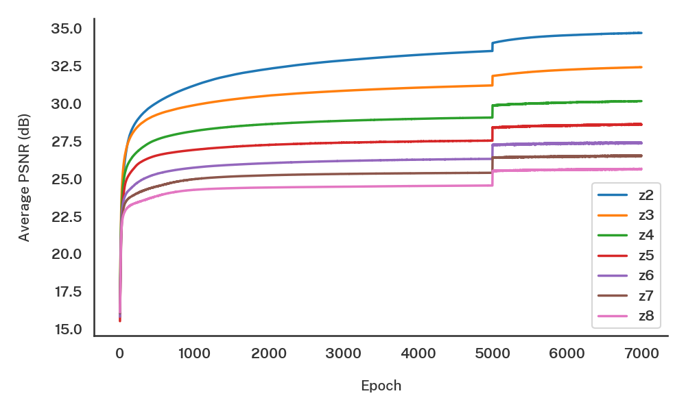

# pytorch-srcnn



A PyTorch implementation of the [SRCNN](http://mmlab.ie.cuhk.edu.hk/projects/SRCNN.html) network designed by Dong et al. along with pre-trained models for zoom factors 2 through 8.

Install the core dependencies to upscale images using the pre-trained models. Install the extra dependencies if you also want to train your own models.

**Note**: all of the code was developed on a Linux system running Ubuntu 18.04, and certain portions of the project make use of Bash scripts and symlinks. These may not function correctly (or at all) on other operating systems -- however, they are not required.

### Dependencies (core)

- [Python 3](https://www.python.org/) -- Developed with version 3.7, but should work with others.
- [PyTorch](https://pytorch.org/) -- Please install a version with CUDA support if you wish to train models.
- [Pillow](https://pillow.readthedocs.io/en/stable/)
- [NumPy](https://numpy.org/)

### Dependencies (extra)

- [matplotlib](https://matplotlib.org) -- The plotting code makes explicit use of the [Public Sans](https://public-sans.digital.gov/) typeface. Plots may look strange if you don't have this font installed. Alternatively, edit line 28 in `train.py` (and optionally line 22 in `plot.py`) to use your own font.
- [seaborn](https://seaborn.pydata.org/)
- [ImageMagick](https://imagemagick.org/index.php) -- This is only required if you wish to adapt the data preparation Bash scripts for your own use.

### Folder structure

```
├── data/
│   ├── test/                   testing data (Set14 in the paper)
│   ├── train/                  training data (91 images)
│   ├── val/                    validation data (Set5 in the paper)
│   └── convert.sh              convert images to Linux-readable BMPs
├── figs/
│   ├── 7000_z*.png             validation/training PSNRs versus time
│   └── all_val.png             comparison of all validation PSNR traces
├── models/
│   ├── 7000_z*.pt              pre-trained models for zoom factors 2-8
├── psnr/
│   ├── 7000_z*.txt             raw logs of training and validation PSNRs
│   └── plot.py                 script to create all_val.png
├── real-photos/
│   ├── original/               high-res photos for real-world testing
│   ├── z*/                     results of bicubic/SRCNN upscaling
│   ├── downsample.sh           downsample photos for testing
│   └── run.sh                  run bicubic/SRCNN upsampling on photos
├── data.py                     data loading/processing
├── model.py                    model definition
├── train.py                    train a new model
└── upscale.py                  use an existing model
```

### Usage

```
# Using a pre-trained model
python upscale.py -z / --zoom    [zoom factor, pre-trained are 2-8]
                  -e / --epochs  [epochs of training, pre-trained are 7000]
                  -i / --input   [path to load input image]
                  -o / --output  [path to save output image]
                  -s / --source  [optional, path to high-res source for PSNR]
                  -b / --bicubic [optional, perform bicubic upsampling instead of SRCNN]

# Training a new model
python train.py -z / --zoom       [zoom factor]
                -e / --epochs     [epochs of training]
                -b / --batch-size [size of minibatch]
                -c / --cuda       [use the GPU for training]
                -r / --resume     [optional, model to load and continue training]
```

File naming is taken care of automatically, with the exception of the output image from `upscale.py`. The convention is `[number of epochs]_z[zoom factor]`. For example, all files associated with a 3x model trained for 7000 epochs will be prefixed with `7000_z3`.

Each run of `train.py` will produce three files:

- a plot of training and validation PSNR over time in `figs/[prefix].png`
- a saved PyTorch model in `models/[prefix].pt`
- a raw log of training and validation PSNR at each epoch (along with the final PSNR on the test set) in `psnr/[prefix].txt`

It is also possible to train a model in multiple stages. First, use `train.py` as normal. Then, use `train.py` with the `-r` flag (passing in just the prefix from the previous run) to continue training. The number of epochs for the second run should be the number of *additional* epochs -- for example, if you initially trained a model for 5000 epochs and wanted 7000 epochs of training, you would use `-e 2000` in the second run. The program will automatically take care of prefixing to produce `7000_z*` files.

### Pre-trained models

The repository includes pre-trained models for zoom levels 2 through 8. These have been trained for 7000 epochs each -- the first 5000 with a batch size of 16, and the last 2000 with a batch size of 4. The z3 model achieves a PSNR of 32.42 dB (compared to the paper's 32.39 dB). Below is a plot of validation PSNR over time for each model.

